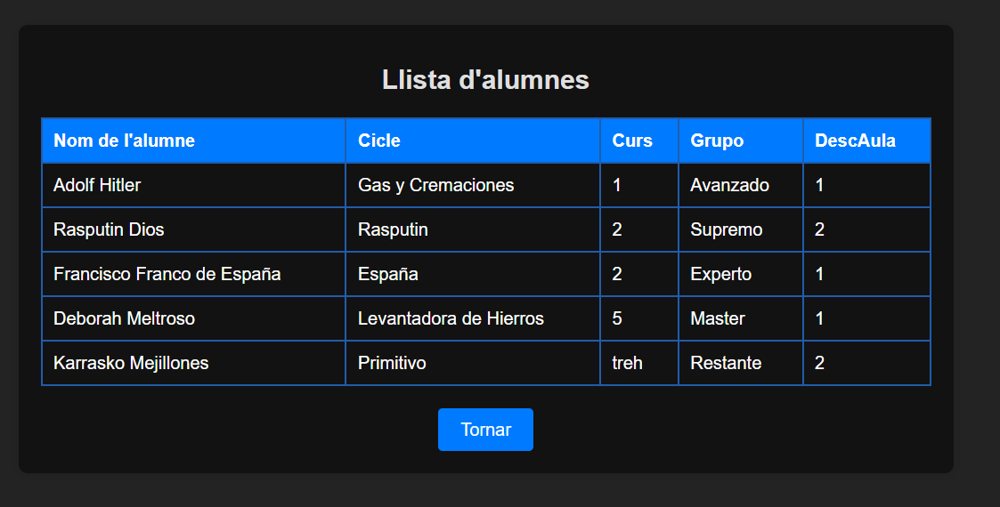

Aquest és el codi incomplet a la part del java script

1. Tabla usuarios usando js

2. OrderBy asc/desc

Contains

skip & limit

Insert a traves de csv 1

Si intento cargar el mismo archivo de nuevo con los mismos datos:

Cargando un csv con 1000 alumnos generado por mi amigo el chatty. Todos los valores son generados aleatoriamente (dentro de unos margenes) y he permitido que haya duplicados en la columna DescAula, para comprobar que no me pusiese repetidos ya que no deberia.

De estos 1000 alumnos nuevos, el nº de cargados son:

30 Aulas, lo cual es correcto ya que, aunque le he dicho que puede haber repetidos, los valores que le he dicho que puede colocar es entre A01-A15 hasta C01-C15 (queria meter B por en medio pero se lo ha fumado el chatty y me sirve igualmente para hacer pruebas)

Y no ha insertado todos los alumnos, lo cual tiene logica porque yo le he permitido que haya duplicados y este los reconoce y no hace el insert